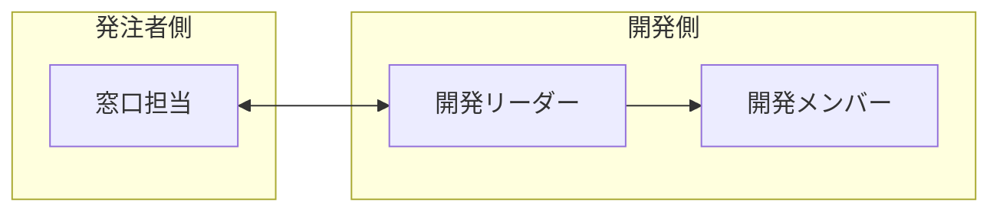

# 要件定義書

**プロジェクト名**: <!-- 例：顧客管理システム開発 -->

---

## 1. 背景・目的

<!-- 
なぜこのシステムが必要なのか、何を解決したいのかを記載

例：
現在、顧客情報はExcelで管理しており、複数担当者での同時編集ができない。
本システムにより顧客情報の一元管理と業務効率化を実現する。
-->

## 2. システム概要

<!-- 
開発するシステムの概要を1〜3文程度で簡潔に

例：
Webベースの顧客管理システム。顧客情報の登録・検索・編集機能を提供する。
-->

---

## 3. スコープ

### 対象範囲

<!-- 本プロジェクトで対応する範囲 -->

-
-
-

### 対象外

<!-- 明確に対応しない範囲（認識齟齬防止のため重要） -->

-
-

---

## 4. 機能要件

<!-- システムが提供する機能を一覧で記載 -->

| 機能名               | 概要                          |
|-------------------|-----------------------------|
| <!-- 例：ユーザー登録 --> | <!-- 例：新規ユーザーをシステムに登録する --> |
|                   |                             |
|                   |                             |

<!-- 
必要に応じて機能の詳細を追記：

### ○○機能
- 目的: 
- 入力: 
- 処理: 
- 出力: 
-->

---

## 5. 非機能要件

<!-- 該当する項目のみ記載、不要な行は削除 -->

- **対応ブラウザ**: <!-- 例：Chrome / Edge 最新版 -->
- **想定ユーザー数**: <!-- 例：同時接続10名程度 -->
- **セキュリティ**: <!-- 例：HTTPS対応 -->
- **その他**:

---

## 6. 成果物

<!-- 納品する成果物 -->

- ソースコード一式（Gitリポジトリ）
- 設計書（画面設計、DB設計など）
- <!-- 必要に応じて追加 -->

---

## 7. 体制

<!-- 
社内開発の場合は省略可。
顧客とやり取りがある場合のみ記載。
-->

<!-- または箇条書きで：
- 発注者側窓口: ○○
- 開発リーダー: ○○
- 開発メンバー: ○○
-->

---

## 8. スケジュール

<!-- 主要なマイルストーンを箇条書きで記載 -->

- **要件定義**: MM/DD 〜 MM/DD
    - 要件ヒアリング、要件定義書作成
- **設計**: MM/DD 〜 MM/DD
    - 画面設計、DB設計、API設計
- **開発**: MM/DD 〜 MM/DD
    - 実装、単体テスト
- **テスト・納品**: MM/DD 〜 MM/DD
    - 結合テスト、受入テスト、検収

---

## 9. 特記事項

<!-- 
前提条件、制約条件、リスク、注意点などをまとめて記載。
該当がなければ「特になし」でOK。

例：
- 発注者側にて本番環境のサーバーを用意する
- 要件変更が発生した場合は別途協議の上、スケジュール・費用を調整する
- 使用技術：PHP 8.x / Laravel 10.x
- 既存データの移行は別途相談
-->

-
- 
